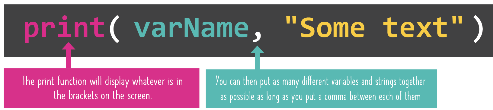

# Concatenate

## Yeah, big word.
All it really means is  **combine** text (remember, text is called a string) and variables together into single sentences! 😲🤯

 You can make your input and output look super pretty now! 🥳

👉 Copy the code below into `main.py` and `run` it. See what it does:

```python
myName = input("What's your name? ")
myLunch = input("What are you having for lunch? ")
print(myName, "is going to be chowing down on", myLunch, "very soon!")
```

You just made a full sentence, right? But how did it work?

- It turns out `print` has a super-power. 
  We can give it as **many** different things to print as we want.
  All we need to do is put a comma `,` between every different thing in the `()`.
  



&nbsp;

👉 Let's go BIG and try a bunch of code...
*You probably know this by now, but make sure you delete any old code first and add all code to `main.py`.*

```python
number = input("Give me a number: ")
group = input("Give me a collective noun for a group of things: ")
thing = input("Give me the name of a weird or wacky thing: ")
print("No I don't think that", number, "is a", group, "of", thing,". That's just odd.")
```
### You can combine as many things as you want in any order you want, as long as they're separated by that comma!

